# Background on HDF5

[HDF5](https://www.hdfgroup.org/solutions/hdf5/) is a file format structured like a file system; data is stored in arbitrary NxN datasets, which are organized in a hierarchy in groups and sub-groups. Groups can contain datasets and groups. Datasets can be of any dimension and any data type, including complex data types (i.e. structs in C). HDF5 files are self-describing; datasets and groups have attribute lists that contain their metadata.

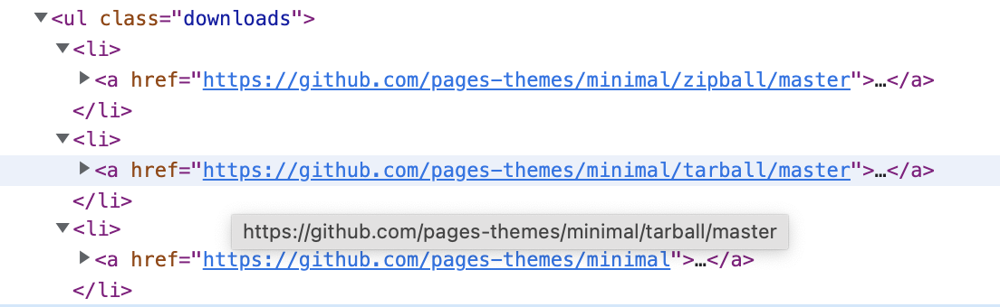

The main use benefits of HDF5 involve customizability, self-description, and scalability. 
> As satellites and other instruments increase their ability to collect data at higher and higher resolution, they need a format that can scale easily and that can provide the ability to acquire data quickly, provide access to specific areas of interest out of large masses of information, accommodate increasingly complex and evolving metadata, and be trusted to support long-term archiving. 
> 
> [The HDF Group](https://www.hdfgroup.org/portfolio-item/earth-sciences/)

HDF5 datasets can either be stored contiguously or in chunks, which are indexed by a B-tree. The benefit of storing in chunks is that it allows for chunk-by-chunk compression. The downside is to access the data within a chunk, the entire chunk must be accessed. 

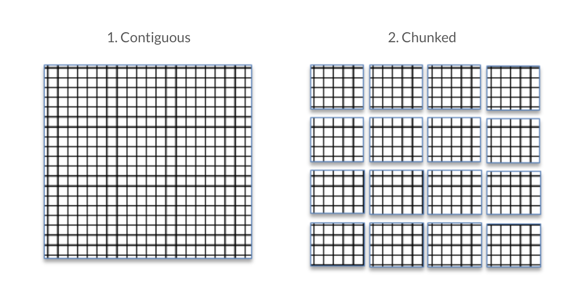
> Source: [Improving I/O Performance When Working with HDF5 Compressed Datasets](https://support.hdfgroup.org/HDF5/doc/TechNotes/TechNote-HDF5-ImprovingIOPerformanceCompressedDatasets.pdf)

So to read one element of a chunked dataset, the entire chunk must first be read into the chunk cache, the chunk must be decompressed, and only then can the individual element be read by the application. Once a chunk is in the chunk cache, any data within that chunk can be read by the application without needing to repeat this process. However, as the chunk cache is only so large and can only fit so many chunks at a time, chunks will be kicked out of the cache once enough other chunks have been accessed. The default chunk cache size is 1MB, but [it can be modified](https://stackoverflow.com/questions/14653259/how-to-set-cache-settings-while-using-h5py-high-level-interface) if your system has the resources. 

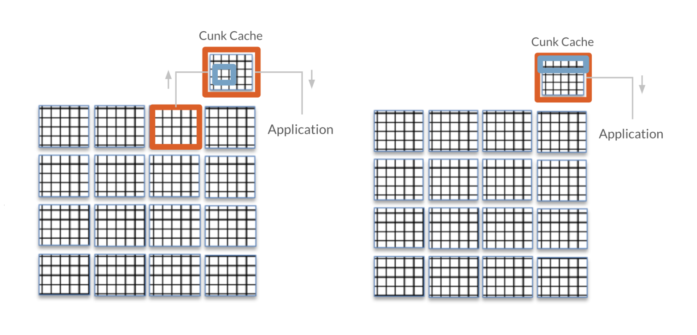
> Source: [Improving I/O Performance When Working with HDF5 Compressed Datasets](https://support.hdfgroup.org/HDF5/doc/TechNotes/TechNote-HDF5-ImprovingIOPerformanceCompressedDatasets.pdf) with minor changes to illustrate the chunk cache

Selecting an appropriate chunk size is not as important as selecting an appropriate chunk dimension; if you are aware of the way in which your application will access the data within a dataset, you can align the chunks to the anticipated access pattern to improve access time. For example, given you have an `AxB` or `(A, B)` dimensional dataset, if you chunk by `(1, B)`, then for each row in `A`, you have one chunk that contains all the columns in `B`. If you chunk by `(A, 1)`, for each column in `B`, you have one chunk that contains all the rows in `A`; this is the example shown below. 

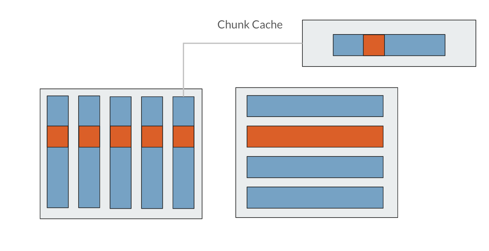

Say for this dataset with `(A, 1)` dimensional chunks, you want to access one row of data, seen in orange above. To access that small square of orange data in the chunk, you have to read the entire chunk into the chunk cache before you can read in the orange data you actually want to access. So, to access the entire row, you would actually have to read in the entire file from disk!

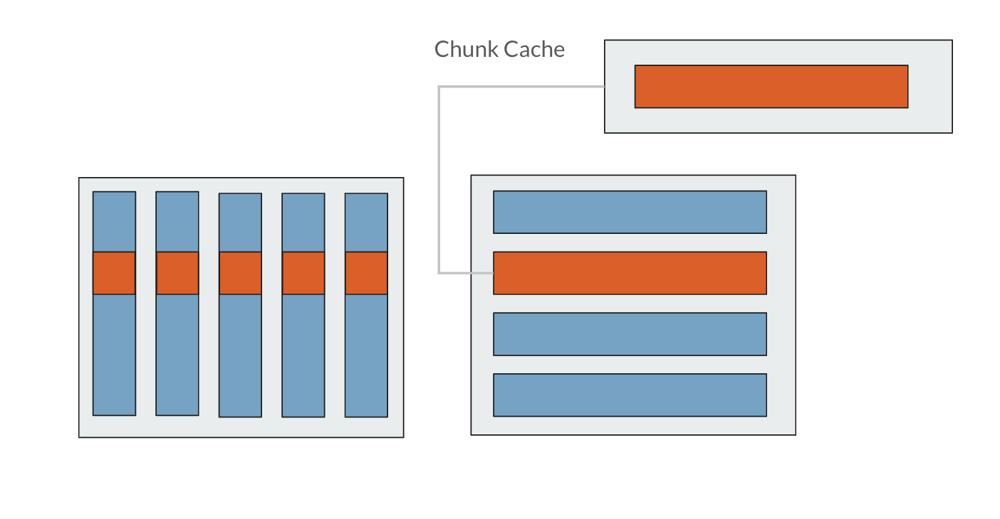

Contrast this with `(1, B)` dimensional chunks, seen above. Because the chunk dimension aligns with the rows, to access one row, you only have to read in one chunk of data. In this way, if you are knowledgeable about the access patterns that your file will need to accommodate, you can select a chunk dimensionality that aligns with it to improve access time. In a similar vein, if you are repeatedly accessing segments of data that are much smaller than your chunk sizes, chunking will have more of a detriment to your access time. 

# Tests
I created a couple Python scripts to test different chunking methods and the compression ratio and read and write times associated with each. To interface with the `HDF5` files, I used [h5py](https://docs.h5py.org/en/stable/).

## Analyzing HDF5 performance on video data
The `chunk.py` program converts a MOV or AVI video file into the other format with [imageio](https://imageio.readthedocs.io/en/stable/), and runs tests on the read time of a single frame from that video.

## Access time & file size with different chunking methods 
The `chunk.py` program converts a MOV or AVI video into HDF5 files with the following chunking methods:
* Default `h5py` chunking method
* One chunk for the entire video
* One chunk per frame in the video
* One chunk per frame and color channel in the video 

The dimensions of the videos are: `(number of frames, height of frame, width of frame, color channel)`. 

As well as converting it to an uncompressed, contiguous (non-chunked) HDF5 file. Running the `chunk.py` program with the `-t` flag runs the access time tests, which analyze the following access patterns:
* Reading and writing one pixel within the video
* Reading and writing one frame within the video
* Reading and writing the entire video

To ensure the reading and writing operations were timed as independent operations, the file under test was closed and reopened between each read or write, and the chunk cache size was set to 0 bytes. The file was also reopened for each test; calling `close()` on a `h5py` is equivalent to a setting the close degree to [H5F_CLOSE_STRONG](https://docs.hdfgroup.org/hdf5/v1_12/group___f_a_p_l.html#title50), i.e. all open objects within the file, such as datasets or groups that were being written or read from, are also closed. 
```python
# test read time of one pixel 
# rdcc_nbytes = chunk cache size
f = h5py.File(path, 'r+', rdcc_nbytes=0)
start = time.time()
# frame number, height, width, color channel
val = f[dset_name][27,0,0,0]
end = time.time()
f.close()
print(f'Pixel read time:        {end-start}')

# test write time of one pixel 
# rdcc_nbytes = chunk cache size
f = h5py.File(path, 'r+', rdcc_nbytes=0)
start = time.time()
# frame number, height, width, color channel
f[dset_name][27,0,0,0] = 0
end = time.time()
f.close()
print(f'Pixel write time:       {end-start}')
```

# Results

## HDF5, MOV, and AVI

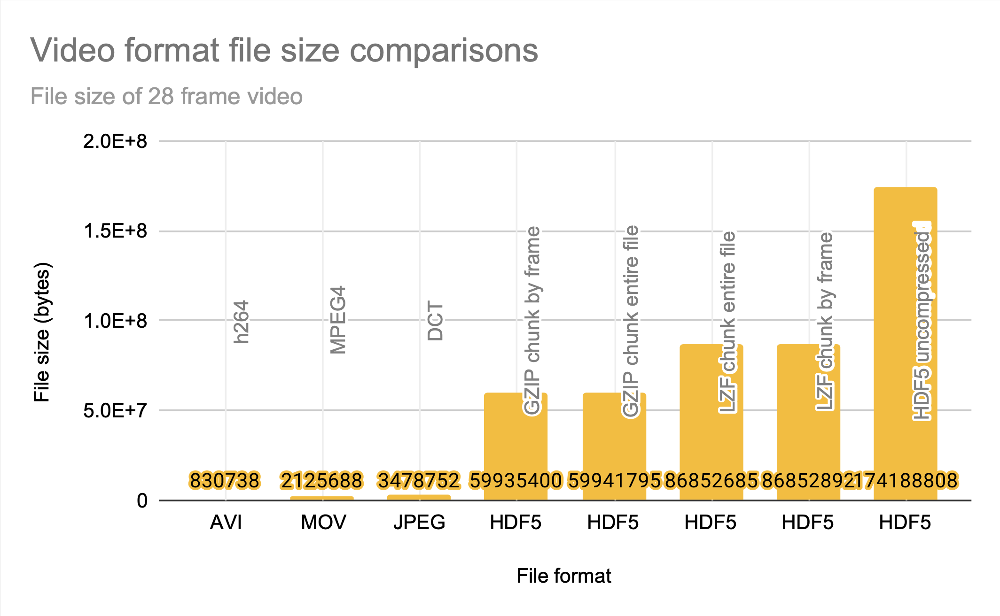
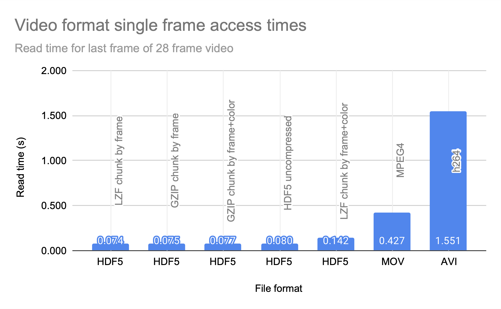

HDF5 clearly prioritizes access time over compression, and is a good choice for applications that are knowledgeable about their access patterns and can align the chunks to match them. The `JPEG` file size entry is just the sum of the sizes of all 28 frames of the video as JPEGs; it's easy to see that even without motion-prediction coding, the `HDF5` files take up significantly more space.

## Chunking methods

Compression ratio achieved with `gzip` for different chunking methods has a general trend of a smaller chunk size leading to larger files; more chunks mean more entries into the B-tree the chunks are stored in, and smaller intervals that can be compressed.  

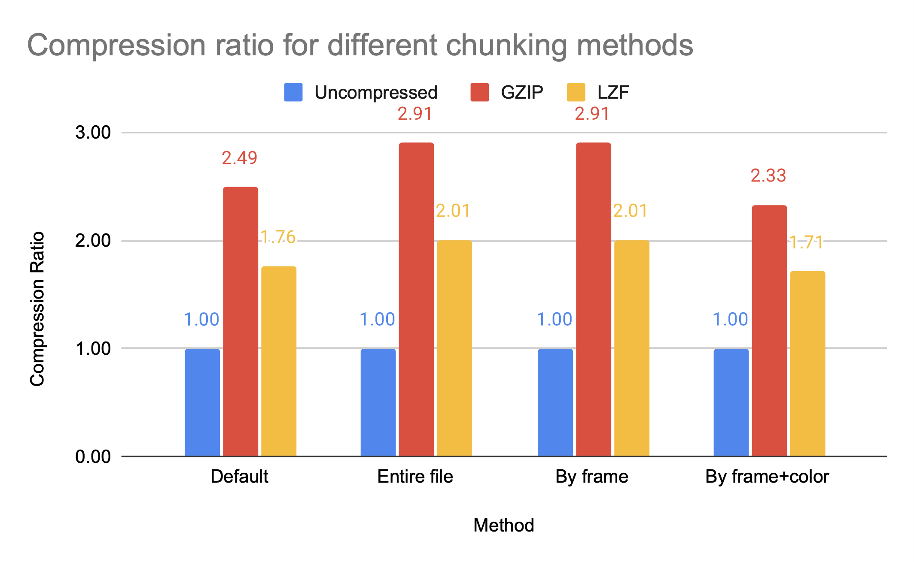

Chunking methods `whole` and `by frame` are larger chunks, and have higher compression ratios than `by frame+color`. However, `by frame+color` has significantly faster access times, as seen in the figures below; read and write times for HDF5 video files with different chunking methods, all compressed with `gzip`. 

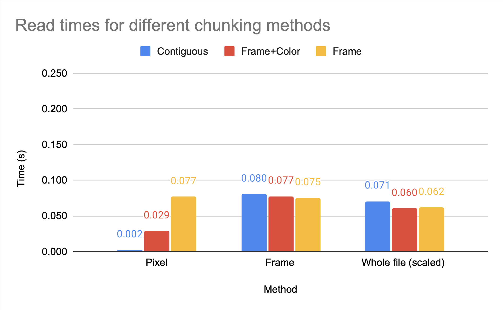
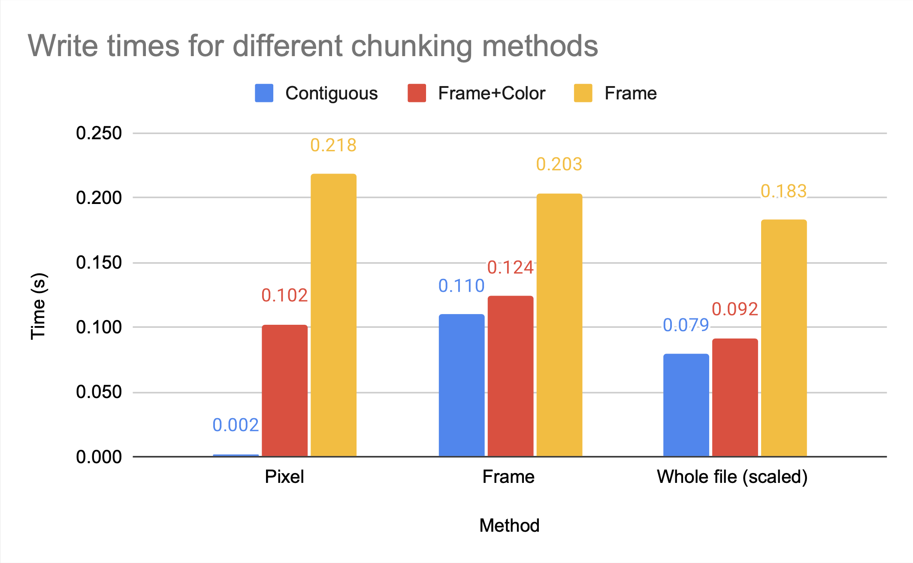

Note that [gzip compression scales poorly](https://superuser.com/questions/599329/why-is-gzip-slow-despite-cpu-and-hard-drive-performance-not-being-maxed-out), which is the cause of the inefficient write times for `by frame` but not `by frame+color`. While `whole` and `by frame` provide similar compression ratios, the access time to the `whole` file is significantly worse than the access time to the `by frame` file unless the entire file is being accessed.

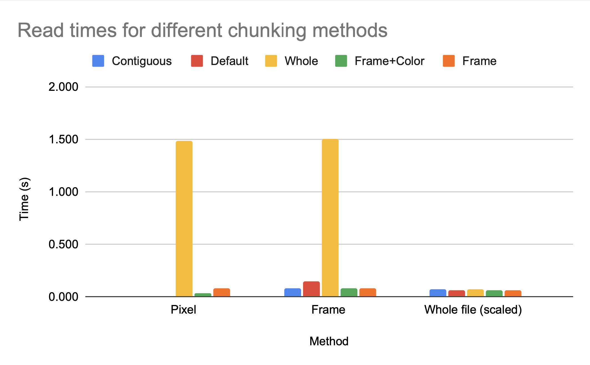
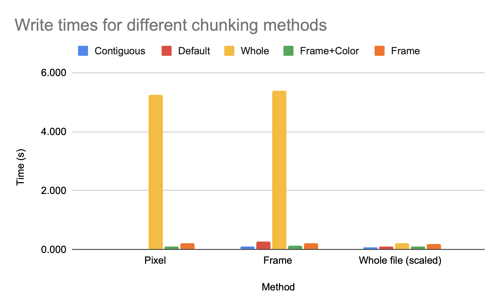

This makes logical sense; if the access is an access to the entire file, then every chunk will have to be accessed, compressed, and/or uncompressed regardless of the chunk size. If you are making an application where the access pattern is known to be the entire file, you can optimize chunk size for compression with relatively little cost to access time. 

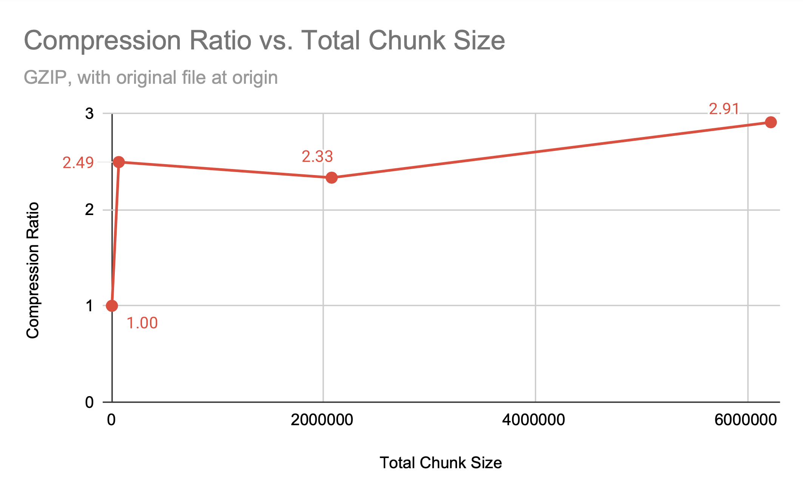

Note that the better compression ratio is not a result of the larger chunk size; the `default` `h5py` chunk dimensions provide a better compression ratio than chunking `by frame+color`, despite having significantly more chunks of a smaller size. While there is a relationship between chunk size and compression ratio, it is clearly not the only factor. 

| Method         | Chunk size (bytes) | Number of chunks | Dimensions         | Compression Ratio |
|:---------------|:-------------------|:-----------------|:-------------------|:------------------|
| h5py default   | 64800              | 2688             | (2, 240, 135, 1)   | 2.4931            |
| by frame+color | 2073600            | 84               | (1, 1920, 1080, 1) | 2.3309            |

However, because we know the access pattern is by frame, we know this default chunking method will not provide efficient access time; the dimensionality is `(2, 240, 135, 1)`, so multiple frames are grouped together but the pixels for each frame are split among blocks.

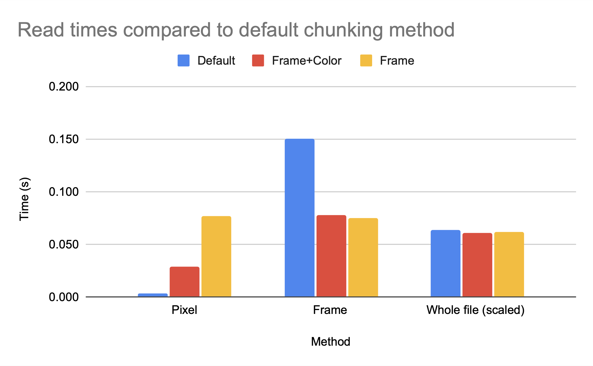
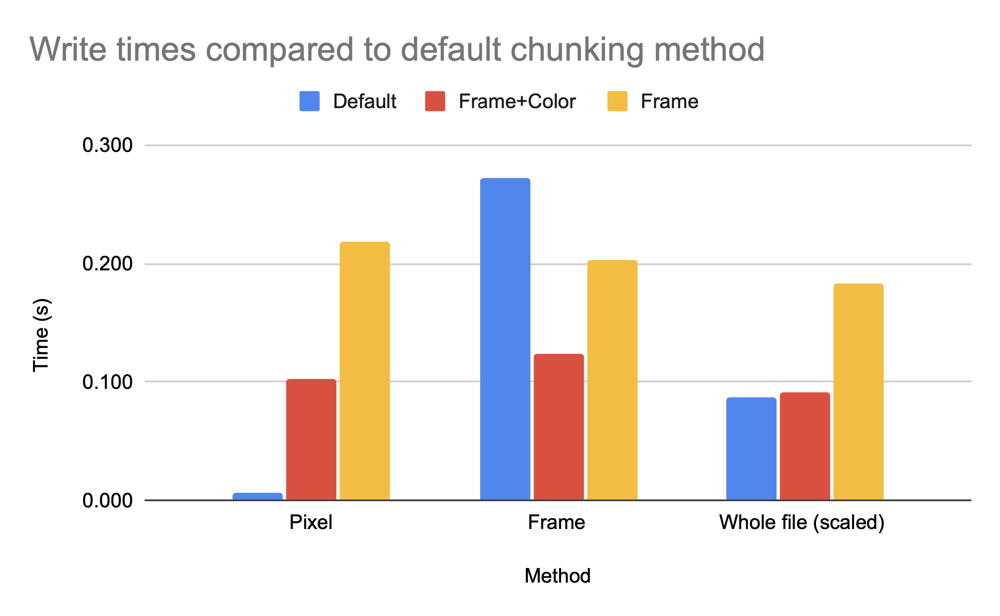

While the access time for a single pixel is clearly much better for `default`, which makes sense as `default` has smaller chunk sizes and therefore less data has to be read in per element accessed, the access time for a single frame is significantly worse for `default` then for either `by frame+color` or `by frame`. While `h5py` can make intelligent decisions on chunk sizes for compression ratio, only someone with knowledge of the access patterns can make an intelligent decision on the chunk dimensions. 

## Compression algorithms
The avaialble 3rd-party compression algorithms from [hdf5plugin](http://www.silx.org/doc/hdf5plugin/latest/usage.html) included algorithms that performed better than and worse than the HDF5-included `gzip` when it came to total compression acheived.

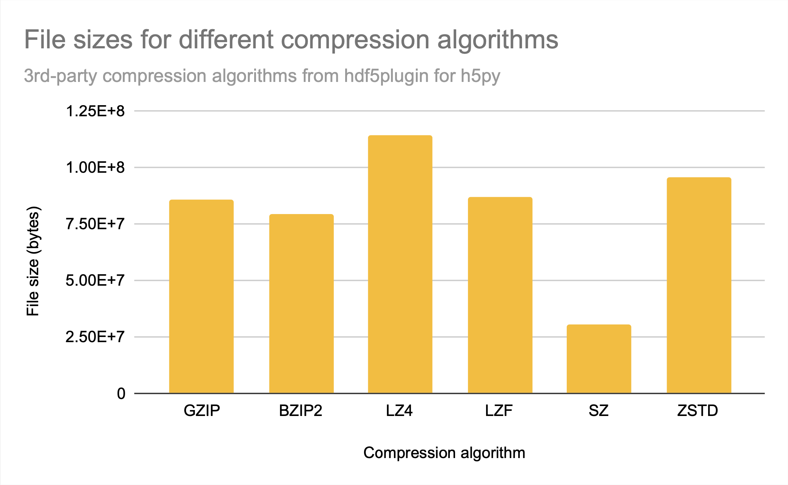

While `sz` is clearly the best compression algorithm among those provided for file size, `lz4` and `zstd` had the fastest access times. While they provide similar access times, `zstd` has a bit better compression ratio. 

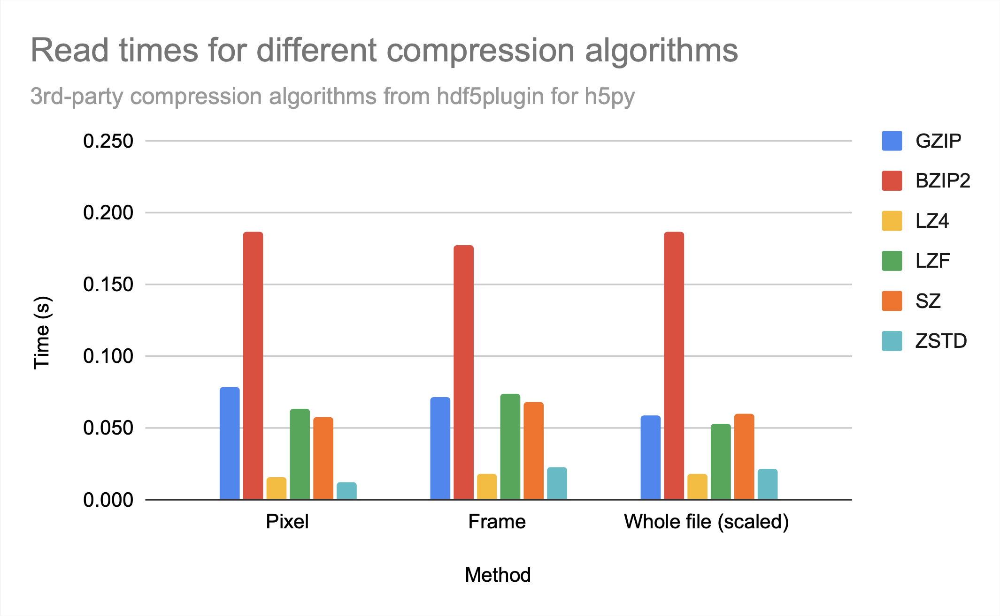
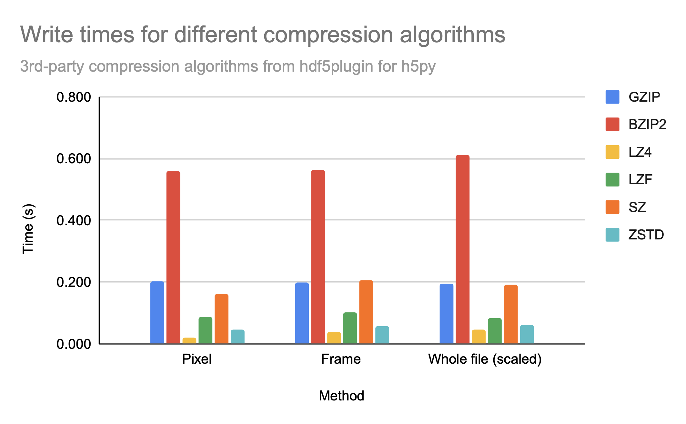

Note that `bzip2` seems to provide neither relatively good compression nor relatively fast access times in comparison to other available 3rd-party compression algorithms, as `gzip`, which creates only a slightly larger file, has significnatly better access times, similar to `sz`. 

For all the compression algorithms provided, read time is worse than write time, probably indicating that compression takes longer than decompression. 

## Conclusions 
1. `HDF5` files prioritize `speed` of access over `compression`
2. You can avoid detriment to access time by aligning your chunks with your access pattern; because `chunks are stored contiguously`, accessing a chunk only costs the compression and decompression time
3. Aside from selecting a chunk size that strikes a balance between compression and access time that best fits your application, you must also `select a compression algorithm` that strikes a balance between compression and decompression that best fits your application
4. If you really only want to access the entire file at a time, then compression is `(almost) free` 


# Run these tests yourself

1. Choose a MOV or AVI video (<= 40 frames recommended as it is processing intensive)
2. Clone the github
3. Install `Python 3.10` & check version to ensure 3.10 is installed: `python3 --version`
5. Run `./install.sh` to locally install `pip3` packages required for this project (or view `install.sh` and install the packages manually)
6. Make a `files/` directory and copy your selected video into it
7. Run `./chunks.py -f files/[your_file.mov]` to convert your video to HDF5 files
8. Modify the dimensions of the I/O test as shown below
9. Run `./chunks.py -f files/[your_file.mov] -t` to run the I/O tests

Note: the dimensions within the access time test may need to be modified, as the current dimensions are hardcoded to the dimensions of my test file; (28, 1920, 1080, 3), or a 28-frame 1920x1080 pixel 3-channel color video. 
```python
# test read of entire file
f = h5py.File(path, 'r+', rdcc_nbytes=0)
start = time.time()
frame = f[dset_name][0:27,0:1919,0:1079,0:2]
end = time.time()
f[dset_name][0:27,0:1919,0:1079,0:2] = frame
f.close()
```

The slices to read the entire file are from `0:number_of_frames`, `0:height_of_frame`, `0:width_of_frame`, and `0:number_of_color_channels`. For example, to modify this test to run for a 30 frame 3072x2304 color video, i.e. a video with dimensions (30, 3072, 2304, 3), the modified code would be:
```python
# test read of entire file
f = h5py.File(path, 'r+', rdcc_nbytes=0)
start = time.time()
frame = f[dset_name][0:29,0:3071,0:2303,0:2]
end = time.time()
f[dset_name][0:29,0:3071,0:2303,0:2] = frame
f.close()
```

The dimensions of your selected video's frames are displayed when running `./chunks.py`, after displaying the metadata on that video. For example, my video has a frame dimension of (1920, 1080, 3).
```
Path: files/movies/katrina.mov 
Size:       2125688

...

 'rotate': 0,
 'size': (1080, 1920),
 'source_size': (1080, 1920)}
Shape: (1920, 1080, 3)
```

The number of frames in your selected video can be discovered by running `./chunks.py -j` to write the frames as JPEG images. For example, my video has 28 frames. 
```
Writing JPEGs...
Frame 1: 127850
Frame 2: 129607

...

Frame 28: 126611
Saved frames 1-28
Total size: 3478752
```

Since the dimensions are (number of frames, height of frame, width of frame, number of color channels), my total video dimensions are: (28, 1920, 1080, 3), so my slices are as follows in the I/O test:
```python
# last frame's 0x0 pixel on color channel 0
pixel = f[dset_name][27,0,0,0]
# last frame's 1920x1080 image on all three channels
one_frame = f[dset_name][27,0:1919,0:1079,0:2]
# all frames of all 1920x1080 images on all three channels
all_frames = f[dset_name][0:29,0:3071,0:2303,0:2]
```

# Or expand on it
## Third-party compression algorithms 
Multiple compression algorithms are available for the chunked `HDF5` files, including 3rd party compression algorithms. These can be specified with the `-c [algorithm]` option. While I compared the differences in file sizes and access time for different types of access for most of these algorithms when chunking `by frame`, a future experiment could be comparing compression algorithms' performance with different chunking methods or different data types. 

```python
# Available compression algorithms & their names
ALGS = {'gzip'      : 'gzip',
        'lzf'       : 'lzf',
        'bitshuffle': hdf5plugin.Bitshuffle(),
        'blosc'     : hdf5plugin.Blosc(),
        'bzip2'     : hdf5plugin.BZip2(),
        'lz4'       : hdf5plugin.LZ4(),
        'sz'        : hdf5plugin.SZ(absolute=0.1),
        'zfp'       : hdf5plugin.Zfp(reversible=True),
        'zstd'      : hdf5plugin.Zstd()}
```

## Memory access type
Memory access, even on a personal computer, [is complicated](https://www.cs.uic.edu/~jbell/CourseNotes/OperatingSystems/8_MainMemory.html). Operating systems present an illusion of contiguous memory, while allocating blocks of memory that align with easier-to-access blocks in physical memory. Most also wait to write to disk until the opportune moment and make replicas of files to protect against data loss. All of these factors play a role in my measured access time. 

## Mixed datasets
One of the main benefits of `HDF5` files is that they can store arbitrarily complex data types within the datasets, including complex data types. A future experiment could involve comparing access time and compression ratio of `HDF5` files and other file formats for increasingly complex data types to see if `HDF5` provides any significant advantage over alternatives, or seeing how `HDF5` compares to other mixed-type dataset file formats.

# References
