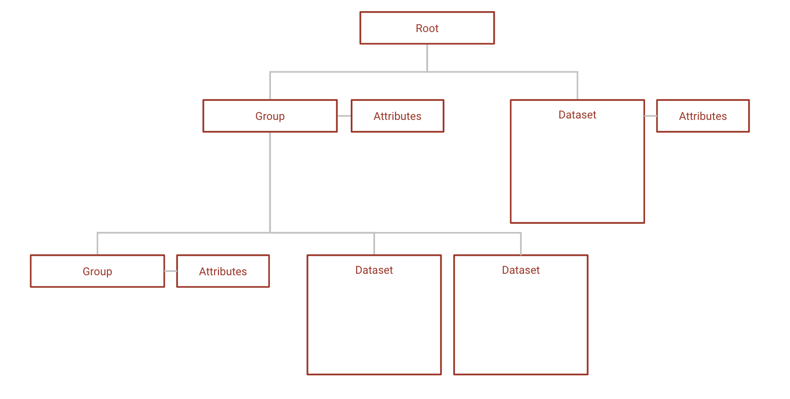

# Background on HDF5

[HDF5](https://www.hdfgroup.org/solutions/hdf5/) is a file format structured like a file system; data is stored in arbitrary NxN datasets, which are organized in a hierarchy in groups and sub-groups. Its main benefits involve customizability, self-description, and scalability. 
> As satellites and other instruments increase their ability to collect data at higher and higher resolution, they need a format that can scale easily and that can provide the ability to acquire data quickly, provide access to specific areas of interest out of large masses of information, accommodate increasingly complex and evolving metadata, and be trusted to support long-term archiving. 
> 
> [The HDF Group](https://www.hdfgroup.org/portfolio-item/earth-sciences/)



HDF5 datasets can either be stored contiguously or in chunks, indexed by a B-tree. The benefit of storing in chunks is that it allows for chunk-by-chunk compression. The downside is to access the data within a chunk, the entire chunk must be accessed. 


> Source: [Improving I/O Performance When Working with HDF5 Compressed Datasets](https://support.hdfgroup.org/HDF5/doc/TechNotes/TechNote-HDF5-ImprovingIOPerformanceCompressedDatasets.pdf)

So to read one element of a chunked dataset, the entire chunk must first be read into the chunk cache, the chunk must be decompressed, and only then can the individual element be read by the application. Once a chunk is in the chunk cache, any data within that chunk can be read by the application without needing to repeat this process. However, as the chunk cache is only so large and can only fit so many chunks at a time, chunks will be kicked out of the cache once enough other chunks have been accessed. 


> Source: [Improving I/O Performance When Working with HDF5 Compressed Datasets](https://support.hdfgroup.org/HDF5/doc/TechNotes/TechNote-HDF5-ImprovingIOPerformanceCompressedDatasets.pdf) with minor changes to illustrate the chunk cache

Selecting an appropriate chunk size is not as important as selecting an appropriate chunk dimension; if you are aware of the way in which your application will access the data within a dataset, you can align the chunks to the anticipated access pattern to improve access time. 

REMEMBER: 2000 words typical, 4000 words max

# Tests
## Access time & file size with different chunking methods 
The `chunk.py` program converts an MOV or AVI video into HDF5 files with the following chunking methods:
* Default h5py chunking method
* One chunk for the entire video
* One chunk per frame in the video
* One chunk per frame and color channel in the video 

As well as converting it to an uncompressed, contiguous (non-chunked) HDF5 file. Running the `chunk.py` program with the `-t` flag runs the access time tests, which analyze the following access patterns:
* Reading and writing one pixel within the video
* Reading and writing one frame within the video
* Reading and writing the entire video

To ensure the reading and writing operations were timed as independent operations, the file under test was closed and reopened between each read or write, and the chunk cache size was set to 0 bytes. 

# Results

## HDF5, MOV, and AVI


HDF5 clearly prioritizies access time over compression, and is a good choice for applications that are knowledgeable about their access patterns and can align the chunks to match them. 

## Chunking methods

Compression ratio acheived with gzip for different chunking methods has a general trend of a smaller chunk size leading to larger files; more chunks mean more entries into the B-tree the chunks are stored in, and smaller intervals that can be compressed.  


Chunking methods **whole** and **by frame** are larger chunks, and have higher compression ratios than **by frame+color**. However, **by frame+color** has significantly faster access times, as seen in the figures below; read and write times for HDF5 video files with different chunking methods, all compressed with gzip. 


Note that gzip compression scales poorly, which is the cause of the inefficient write times for **by frame** but not **by frame+color**. While **whole** and **by frame** provide similar compression ratios, the access time to the **whole** file is significantly worse than the access time to the **by frame** file unless the entire file is being accessed.


This makes logical sense; if the access is an access to the entire file, then every chunk will have to be accessed, compressed, and/or uncompressed regardless of the chunk size. If you are making an application where the access pattern is known to be the entire file, you can optomize chunk size for compression with relatively little cost to access time. 


Note that the better compression ratio is not a result of the lower chunk size; the default h5py chunk dimensions provide a better compression ratio than chunking **by frame+color**, despite having significantly more chunks of a smaller size. 

| Method         | Chunk size (bytes) | Number of chunks | Dimensions         |
|:---------------|:-------------------|:-----------------|:-------------------|
| h5py default   | 64800              | 2688             | (2, 240, 135, 1)   |
| by frame+color | 2073600            | 84               | (1, 1920, 1080, 1) |

# Run these tests yourself

1. Choose a MOV or AVI video (<= 40 frames recommended as it is processing intensive)
2. Clone the github
3. Follow the instructions on the [README.md](https://github.com/bgoodwine/HDF5#readme) to install the required pip3 packages and run the `chunks.py` program with your file as an input

Multiple compression algorithms are available for the chunked HDF5 files, including 3rd party compression algorithms. These can be specified with the `-c [algorithm]` option.

```python
# Available compression algorithms & their names
ALGS = {'gzip'      : 'gzip',
        'lzf'       : 'lzf',
        'bitshuffle': hdf5plugin.Bitshuffle(),
        'blosc'     : hdf5plugin.Blosc(),
        'bzip2'     : hdf5plugin.BZip2(),
        'lz4'       : hdf5plugin.LZ4(),
        'sz'        : hdf5plugin.SZ(absolute=0.1),
        'zfp'       : hdf5plugin.Zfp(reversible=True),
        'zstd'      : hdf5plugin.Zstd()}
```
